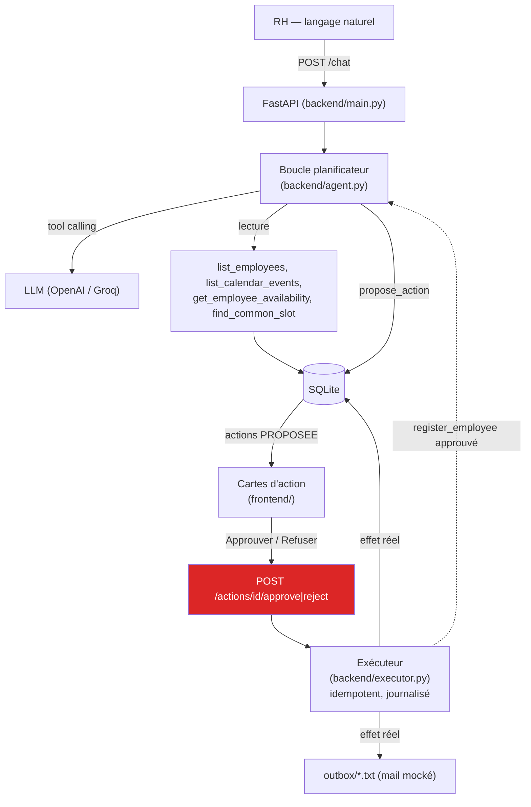

# Architecture — Tauturu

Agent branché sur des outils à effets de bord réels (base employés,
calendrier ; mail mocké en fichier local), avec validation humaine action
par action (pattern *human-in-the-loop*). Rien ne s'exécute sans
approbation.

## Schéma

La flèche en pointillé (`register_employee approuvé → Planner`) est
l'auto-continuation : une fois cette action précise exécutée, le
planificateur est relancé tout de suite pour proposer la suite du plan,
sans que le RH ait à retaper quoi que ce soit (voir AGENTS.md).

## Les couches

- **Frontend — interface d'approbation** : l'utilisateur saisit une
  intention en langage naturel, le plan généré s'affiche carte par carte,
  et il valide *action par action*. L'onglet Historique liste l'audit
  complet (lecture seule — pas d'annulation depuis cet écran, seulement
  via une nouvelle action `delete_*` proposée par l'agent).
- **Couche agent** : reçoit l'intention (`POST /chat`), raisonne (boucle
  planificateur + LLM avec tool calling) et produit un plan d'actions —
  jamais d'exécution directe, voir AGENTS.md.
- **Exécuteur** : du code classique, sans appel LLM. Ne lance que les
  actions à l'état `APPROUVEE`, de façon idempotente (vérifie le journal
  avant d'agir), et ne les duplique pas si on les rejoue.
- **Couche outils — effets de bord** : `register_employee`,
  `delete_employee` (base employés, réel) ; `create_calendar_event`,
  `delete_calendar_event` (calendrier mocké en SQLite) ; `send_email`
  (fichier écrit dans `outbox/`, aucun envoi réel). Mocks assumés et
  documentés (voir SPEC.md, hors scope) — pas d'intégration à une vraie
  API externe.
- **Stockage** : SQLite unique (`backend/agent.db`) pour les employés, le
  calendrier, les actions, leur journal d'audit, et les conversations
  persistées (palier 4).

## Le point qui compte

La **gate de validation** (en rouge sur le schéma) est le cœur du sujet :
aucun outil à effet de bord ne s'exécute avant l'approbation humaine.
L'agent *propose*, l'humain *dispose*. Exécuter avant validation est
éliminatoire — et ce n'est pas une règle de prompt : les fonctions à effet
de bord ne sont structurellement jamais données au modèle comme outils
appelables (voir AGENTS.md, "Pourquoi le modèle ne touche jamais aux
effets de bord").
