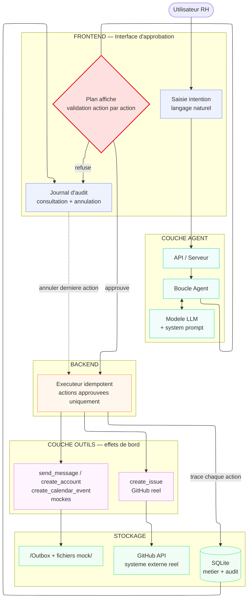

# Architecture — Le Bras

Agent branché sur des outils à effets de bord réels, avec validation humaine
action par action (pattern *human-in-the-loop*). Rien ne s'exécute sans
approbation.

## Schéma

## Les 5 couches

- **Frontend — Interface d'approbation** : l'utilisateur saisit une intention en
  langage naturel, le plan généré s'affiche, et il valide *action par action*.
  Le journal d'audit y est consultable et permet l'annulation.
- **Couche agent** : reçoit l'intention (API), raisonne (boucle agent + LLM avec
  system prompt) et produit un plan d'actions.
- **Backend** : l'exécuteur idempotent ne lance que les actions approuvées, et
  ne les duplique pas si on les rejoue.
- **Couche outils — effets de bord** : `create_issue` touche un vrai système
  externe (GitHub) ; le reste (`send_message`, `create_account`,
  `create_calendar_event`) est mocké localement, choix assumé et documenté.
- **Stockage** : GitHub API (réel), outbox + fichiers mock, et SQLite pour le
  métier et le journal d'audit.

## Le point qui compte

La **gate de validation** (en rouge) est le cœur du sujet : aucun outil à effet
de bord ne s'exécute avant l'approbation humaine. L'agent *propose*, l'humain
*dispose*. Exécuter avant validation est éliminatoire.